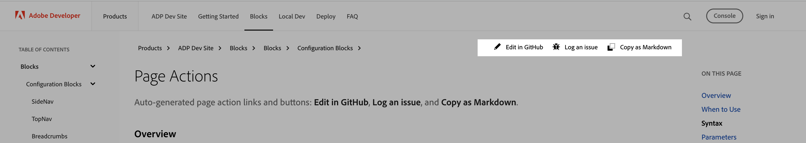

# Page Actions

Auto-generated page action links and buttons: **Edit in GitHub**, **Log an issue**, and **Copy as Markdown**.



## Overview

By default, documentation pages can show:

- **Edit in GitHub**: Link to open the source file on GitHub and propose edits
- **Log an issue**: Button to report a problem with the page (GitHub or your issue tracker)
- **Copy as Markdown**: Button to copy the page content as Markdown

## When to Hide

Consider hiding these actions when:

- **Edit in GitHub**: Restricted content, auto-generated pages, sensitive docs, legal/compliance pages, or content that requires internal review before edits
- **Log an issue**: Pages not open for public feedback, auto-generated content, or internal-only docs where issues are handled elsewhere
- **Copy as Markdown**: Pages where copying source is restricted, sensitive content, or minimal layouts where you want less clutter


## How to hide
To hide one or more of these actions on a page, add the corresponding options to that page’s frontmatter. Each option is independent, so you can combine them as needed.

```yaml
---
title: Your Page Title
hideEditInGitHub: true
hideLogIssue: true
hideCopyMarkdown: true
---
```

## Parameters

| Parameter | Type | Description |
|-----------|------|-------------|
| **hideEditInGitHub** | Boolean | When `true`, hides the "Edit in GitHub" link. Omit or `false` to show it (default). |
| **hideLogIssue** | Boolean | When `true`, hides the "Log an issue" button. Omit or `false` to show it (default). |
| **hideCopyMarkdown** | Boolean | When `true`, hides the "Copy as Markdown" button. Omit or `false` to show it (default). |

## Examples

### Hide only Edit in GitHub

```yaml
---
title: Internal Reference
hideEditInGitHub: true
---
```

### Hide only Log an issue

```yaml
---
title: Feedback Page
hideLogIssue: true
---
```

### Hide only Copy as Markdown

```yaml
---
title: Read-Only Page
hideCopyMarkdown: true
---
```

### Hide all three actions

```yaml
---
title: Locked Down Page
hideEditInGitHub: true
hideLogIssue: true
hideCopyMarkdown: true
---
```

## Example

This page has all three options enabled. The "Edit in GitHub" link and the "Log an issue" and "Copy as Markdown" buttons are not visible in the page action area.

## Best Practices

- Use these options sparingly to keep documentation open and easy to contribute to
- Document internally which pages use these options and why
- Review periodically whether hiding actions is still necessary
