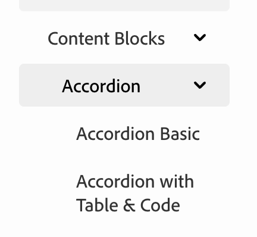

# Side Navigation

Configure sidebar navigation in `config.md` using `subPages`.

## Example

```md
- subPages:
    - [Content Blocks](/blocks/index.md)
      - [Accordion](/blocks/accordion/index.md)
        - [Accordion Basic](/blocks/accordion/accordion-basic.md)
        - [Accordion with Table & Code](/blocks/accordion/accordion-with-table-and-code.md)
```

## Format

`[Display Text](path/to/file.md)`

**Indentation = Nesting:**
```md
- [Overview](blocks/index.md)           # Top level
  - [Accordion](/blocks/accordion/index.md)  # Nested (2 spaces)
    - [Basic](/blocks/accordion/basic.md)     # Nested deeper (4 spaces)
```

## Result



## Link Requirements

Every entry in the side navigation must have a link.

### Path Rules

1. **First-level entries** must use relative paths (relative to `/src/pages/`)
2. **First-level entries** must start with a TopNav item
3. **Child entries** can use either:
   - Relative paths (to pages within your site)
   - Absolute paths (external links like `https://example.com`)

### Examples

```md
- subPages:
    # First level - must be relative and start with a TopNav item
    - [Content Blocks](/blocks/index.md)
      # Children - can be relative or absolute
      - [Accordion](/blocks/accordion/index.md)
      - [External Guide](https://example.com/guide)
```

All relative paths in `config.md` are relative to `/src/pages/`.


## Related

[TopNav](/blocks/topnav/index.md) - Configure top navigation

