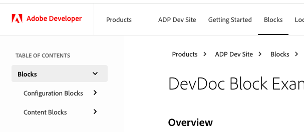
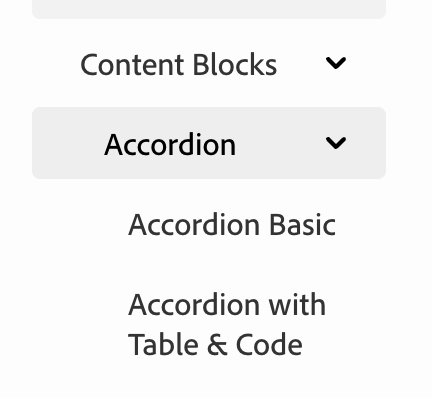
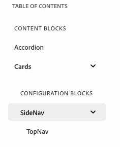

# Side Navigation

Configure sidebar navigation in `config.md` using `subPages`.

## Important: SideNav Requires TopNav

**The sidebar only appears when the current page is under a section defined in the top navigation.** Your `subPages` structure must mirror your `pages` (TopNav) structure:

- **First-level items in `subPages`** = TopNav sections. Each first-level entry should match a section in `pages`.
- **Child items** = The sidebar links that appear when a user is on a page within that section.

If your sidebar isn't showing, the page may not be under a TopNav section, or that section may be missing from `subPages`. See [TopNav](/blocks/topnav/index.md) to configure the top navigation first.

## Example

Your `config.md` needs both `pages` (TopNav) and `subPages` (SideNav). The first-level items in `subPages` should align with your TopNav sections:

```md
- pages:
    - [Overview](index.md)
    - [Blocks](/blocks/index.md)

- subPages:
    - [Overview](index.md)
    - [Blocks](/blocks/index.md)
       - [Configuration Blocks](#configuration-blocks)
         - [SideNav](/blocks/sidenav/index.md)
         - [TopNav](/blocks/topnav/index.md)
       - [Content Blocks](#content-blocks)
         - [Accordion](/blocks/accordion/index.md)
         - [Announcement](/blocks/announcement/index.md)
```



When a user visits topnav `/blocks/index.md`, the sidebar shows the "Blocks" section and its children. 

## Format

`[Display Text](path/to/file.md)`

**Indentation = Nesting:**
```md
- [Overview](blocks/index.md)           # Top level
  - [Accordion](/blocks/accordion/index.md)  # Nested (2 spaces)
    - [Basic](/blocks/accordion/basic.md)     # Nested deeper (4 spaces)
```

## Result



## Headers

You can use headers to organize navigation items into labeled sections.

### Header Format

Headers are **plain text** (not links) that appear as non-clickable labels in the sidebar:

```md
  - subPages:
    - Content Blocks header
    - [Accordion](/blocks/accordion/index.md)
    - [Cards](/blocks/cards/index.md)
    - [Code](/blocks/code/index.md)
```

**Important:** After a header, the next item **must be at the same indentation level** as the header. You cannot indent the items after a header.

### Nested Header Usage

```md

- subPages:
    - Content Blocks header
    - [Accordion](/blocks/accordion/index.md)
    - [Cards](/blocks/cards/index.md)
       - Configuration Blocks header
       - [SideNav](/blocks/sidenav/index.md)
         - [TopNav](/blocks/topnav/index.md)
```

### Result



## Link Requirements

Every entry in the side navigation must have a link (except headers, which are plain text).

**Link Format:**
- **Internal links** must end with `.md` (e.g., `/blocks/accordion/index.md`)
- **External links** must be absolute URLs (e.g., `https://example.com`)

### Path Rules

1. **First-level entries** must use relative paths (relative to `/src/pages/`)
2. **First-level entries** must correspond to a TopNav item — each first-level `subPages` entry represents a section from `pages`; the sidebar for that section only appears when the user is on a page within it
3. **Child entries** can use either:
   - Relative paths ending in `.md` (to pages within your site)
   - Absolute URLs (external links like `https://example.com`)

### Examples

```md
- subPages:
    # First level - must be relative and start with a TopNav item
    - [Content Blocks](/blocks/index.md)
      # Children - can be relative (ending in .md) or absolute URLs
      - [Accordion](/blocks/accordion/index.md)
      - [External Guide](https://example.com/guide)
```

All relative paths in `config.md` are relative to `/src/pages/`.


## Related

[TopNav](/blocks/topnav/index.md) - Configure top navigation

