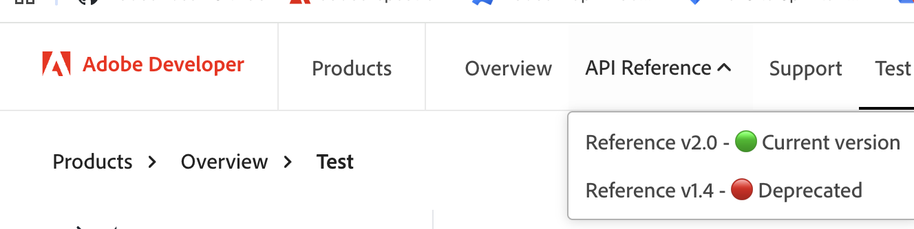

# Top Navigation

Configure top navigation in `config.md` using `pages`.

## Default Links

The top navigation always includes these links first:
- **Adobe Developer** → `developer.adobe.com`
- **Products** → `developer.adobe.com/apis`

Your custom links from `pages` appear after these default links.

## Example

```md
- pathPrefix:
    - /dev-docs-reference/

- pages:
    - [Overview](index.md)
    - API Reference
      - [Reference v2.0](blocks/version1.md) - 🟢 Current version
      - [Reference v1.4](blocks/version2.md) - 🔴 Deprecated
    - [Support](support/index.md) 
```

Indent items to create dropdowns:



## Components

**pathPrefix**: Base URL path prepended to the domain
```md
- pathPrefix:
    - /dev-docs-reference/
```

**pages**: Navigation items in the top bar
```md
- pages:
    - [Home](index.md)
    - [Documentation](docs/index.md)
```

## Buttons

You can add an optional **buttons** section to show action buttons in the top navigation (e.g., Code Playground, Console). Each button is a link followed by optional identifiers.

### Syntax

```yaml
- buttons:
  - [Code Playground](https://www.adobe.com/go/addon-playground?session=saved) playgroundId
  - [Console](https://developer.adobe.com/console/) consoleId
```

### Button identifiers

- **playgroundId**: Identifies the button as a playground (for Code Playground).
- **consoleId**: Identifies the button as the Console link.

The **Console** button may always appear in the top nav regardless of the `buttons` section; confirm behavior in your environment. The first button in your list is typically styled as the primary button and the second automatically takes a secondary button style.

The first button is styled as primary, the rest as secondary.

## Paths

All paths in `config.md` are relative to `/src/pages/`. External links require full paths (e.g., `https://example.com`).

## Related

[SideNav](/blocks/sidenav/index.md) - Configure sidebar navigation
