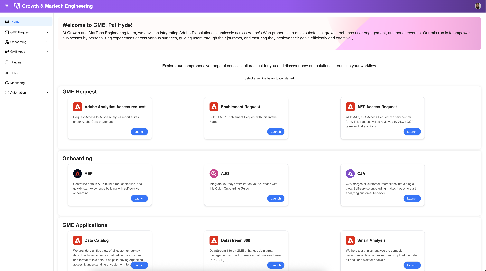
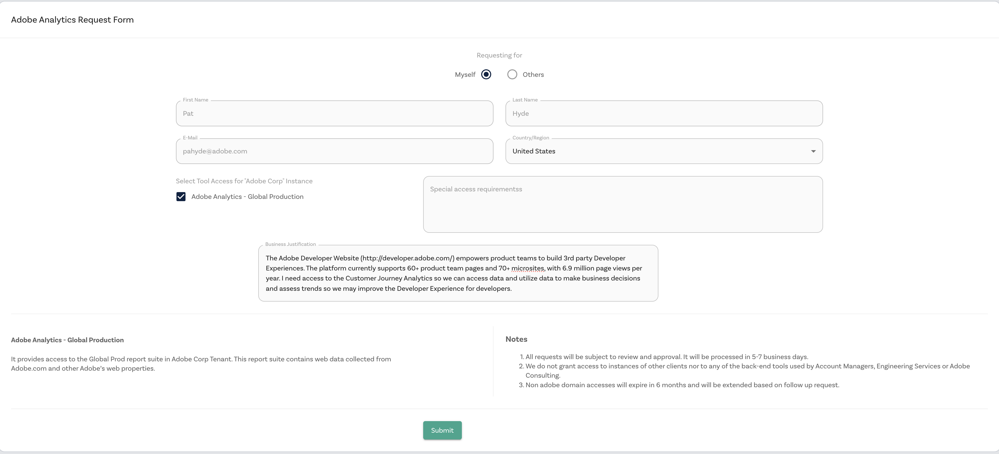
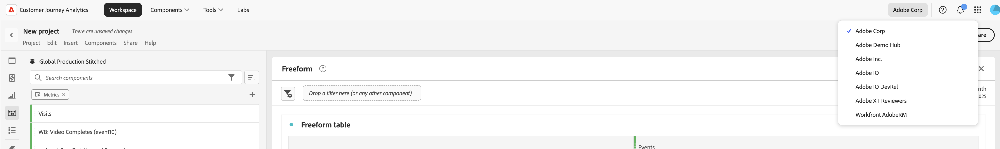
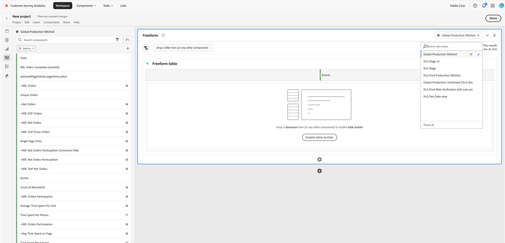
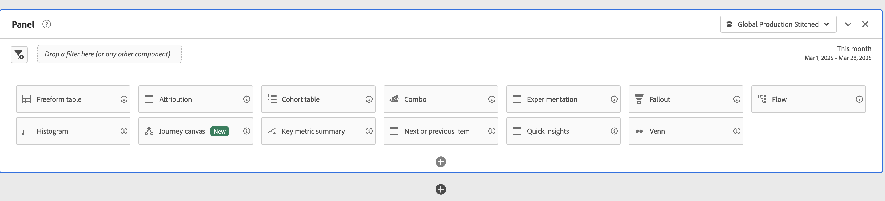

# Adobe Analytics on the Next Generation Developer Website.

Next Generation Developer Website

AEP (Adobe Experience Platform) web SDK migration for Adobe's web properties started back in FY22 to support Analytics Tracking, Target Tests, and other Adobe Experience Cloud Solutions (as per business need).Currently, most of [Adobe.com](http://adobe.com/) and various key pages across Adobe web surfaces to AEP Web SDK based integration have been migrated.Implementing Adobe Experience Platform Web SDK is expected to significantly revamp the current Adobe Analytics data collection but is expected to bring a great set of benefits starting with faster page performance and reduced latency by using a single, unified JavaScript library. This minimizes data discrepancy as individual Adobe solutions will receive data server-side using our edge gateway. Additionally, the AEP Web SDK will enable Customer Journey Analytics on the Developer Website - unlocking the potential to use Analytics Workspaces and leverage data from key Adobe Web surfaces, including [Adobe.com](http://adobe.com/)

The migration to AEP Web SDK will change how you can access and view data for Adobe Analytics. Currently, the AA setup on the Developer Website feeds into the Adobe I/O Analytics workspace and all historical data will remain accessible in the Adobe I/O Analytics workspace. Once the AEP WebSDK is pushed to production on the Developer Website, all data will now flow through Adobe Corp and into the Customer Journey Analytics Workspace utilizing the Global Production reporting suite.

## How to request access to CJA and/or Adobe Analytics

Steps to request access to Adobe Analytics (Must be logged onto VPN): 

1. Visit [https://gme.corp.adobe.com/](https://gme.corp.adobe.com/) and request access to Adobe Analytics and the AEP Access Request. 

2. Fill out this intake process requesting access to Adobe Corp and/or CJA with a stated use case of accessing data for the specific product team on the Global Production Suite of Adobe Analytics.
[https://wiki.corp.adobe.com/display/DATAPLG/Use+Case+Intake+Process](https://wiki.corp.adobe.com/display/DATAPLG/Use+Case+Intake+Process)
    - Business Justification: The Adobe Developer Website (http://developer.adobe.com/) empowers product teams to build 3rd party Developer Experiences. The platform currently supports 60+ product team pages and 70+ microsites, with 6.9 million page views per year. I need access to the Customer Journey Analytics so we can access data and utilize data to make business decisions and assess trends so we may improve the Developer Experience for developers.
3. Create a JIRA ticket in our backlog: [jira.corp.adobe.com/browse/ENB](jira.corp.adobe.com/browse/ENB)  Request access to  "Get tracking on developer.adobe.com" and any details if you have requested access to CJA. 

## Steps to request access to CJA:

Customer Journey Analytics lets you control how you connect your online and offline data in Analysis Workspace on any common customer ID, allowing you to do attribution, filters, flow, fallout, etc. across your customer data.In Customer Journey Analytics, any data source can be part of the data you use for reporting and analysis.

1. Log onto VPN.
2. [Adobe Analytics Request Form](https://nam04.safelinks.protection.outlook.com/?url=https%3A%2F%2Fmarketingtech.corp.adobe.com%2Fuser%2Frequestform&data=05%7C02%7Cpahyde%40adobe.com%7C3a1d0370919c4bc0312d08dce30e3a5e%7Cfa7b1b5a7b34438794aed2c178decee1%7C0%7C0%7C638634897458995447%7CUnknown%7CTWFpbGZsb3d8eyJWIjoiMC4wLjAwMDAiLCJQIjoiV2luMzIiLCJBTiI6Ik1haWwiLCJXVCI6Mn0%3D%7C0%7C%7C%7C&sdata=BoxUF12NryJAvHcdjgXpUufhiCW5PTpMYBtokJwbTRs%3D&reserved=0)
    - Business Justification: 
      - Business Justification: The Adobe Developer Website (http://developer.adobe.com/)  empowers product teams to build 3rd party Developer Experiences. The platform currently supports 60+ product team pages and 70+ microsites, with 6.9 million page views per year. I need access to the Customer Journey Analytics so we can access data and utilize data to make business decisions and assess trends so we may improve the Developer Experience for developers.

3. Once you receive an email granting you access to Customer Journey Analytics, click on the link and it will take you to CJA Workspace. 

## Helpful Tips
- How to Access CJA Workspace
  - Click on Get Started. Sign in with your Adobe email. And you will begin at CJA Analytics Workspace Homepage. 

- Select Adobe Corp Org

- Create a new Workspace
  - Create a new project and select reporting suite. 
  - Currently, XLG Stage will enable you to track any page on developer-stage.adobe.com 
  - After 3/27/2025, you can select Global Production to access any production pages on developer.adobe.com

- How to find simple data
  - After selecting the appropriate reporting suite, you can select dimension and metrics to start building through any of Adobe Analytics capabilities. 
  - Please visit [this](https://experienceleague.adobe.com/en/docs/analytics-platform/using/cja-workspace/home) page to learn more about the different options available. 
