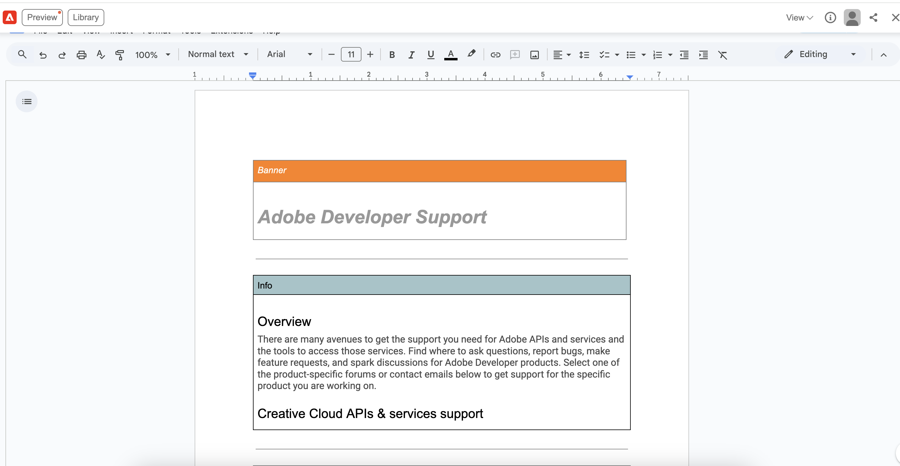
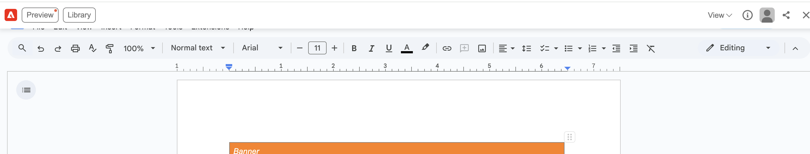
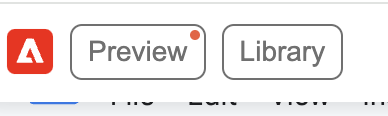

# Dev Biz Onboarding

## What DevBiz Edge Delivery Services is for
The Adobe Developer Website DevBiz mircosites are intended to be for marketing or landing pages. 
- Content is authored and deployed by utilizing Google Docs with your Adobe Gmail account.
- Check out this page for App Builder to get an idea of what a DevBiz page looks like. 
- Check out and install the Sidekick Tool to get familiar with the Adobe Developer Website Content Blocks. 

## How to setup your DevBiz Website
When you're ready to get started, please follow these steps: 

-  If you do not have an Adobe Google account, follow these steps to request one:  
  - Fill out and submit this [form](https://adobe.service-now.com/esc?id=adb_esc_sc_cat_item&sys_id=b6ac31b987363114491adb573cbb35f2).
    - Select license recipient.
    - Roles: Google Drive
    - Business Justification:  The Adobe Developer Website is a cohesive experience for developers to discover, learn about and get started with Adobe’s developer centric products. The Developer Website was built on Edge Delivery Services in 2021 and utilizes Google Accounts to author production product pages. An Adobe Google account is necessary for product page owners to author, edit and publish these pages daily.
  -  Once approved, you will be added to GRP-GOOGLE-SVC-DRIVE (Do not request to join this before taking the steps above, as you will have to restart the process).
- Submit a Jira ticket requesting a Google Drive Folder to be set up.  Submit a [JIRA ticket](https://jira.corp.adobe.com/secure/RapidBoard.jspa?rapidView=31350&projectKey=DEVSITE&view=planning&issueLimit=100) to get started. 
  - Include the following on the JIRA ticket (Summary: Onboard xxx Team to DevBiz):
    - Team:
    - Primary Contact(s):
    - Desired Folder Name:
    - Custom Top Nav (Y/N):
  - Notes:
    - For DevBiz microsites, the folder name is what the path-prefix will become. 
    - If you select N for custom Top Nav, you will have the standard navigation as seen on the home page of the Adobe Developer Website. 
- Once a Adobe Google account has been authorized for the contact, we will be able to add you to the Google Drive folders for stage and productionw we created for you and give you access to the Index file. 
- Add the Sidekick Tool for the different content blocks available to you and so you can have access to edit, preview, live and production for your pages
- All authors need to sign the Adobe Contributor License Agreement (CLA)
- Questions & Support: #adobe-developer-website
- Start writing!

## Authoring
- Utilizing the [Sidekick Tool](https://www.aem.live/tools/sidekick/?project=stage.adobe.io&byocdn=true&host=www.stage.adobe.io&giturl=https%3A%2F%2Fgithub.com%2Fadobe%2Fadobe-io-website%2Ftree%2Fmain) will enable you to copy content blocks directly into your Index file. 
- The Index file in your folder when created will have a sample page with content blocks already inside your folder. You can delete and replace as you'd like, but its generally suggested that your page at the minimum have a site hero or hero content block at the top. 
- You can directly add in images following the Sidekick tool's suggestion on recommended size. You can use the Sidekick tool to also quickly preview content. 

**Steps to Preview Content**
1. Add content and images to your page.

2. When ready to preview, open up sidekick tool in browser.

3. Click on Preview. 

4. You will see in the preview mode what your page looks like.

5. Go back to the Index file to make any changes you'd like. Repeat steps 3 and 4 to see those changes.

6. When satisfied and after your Google Drive folder is connected to the Adobe Developer Website Fastly CDN to enable you to push to production and staging environments, you can then utilize the Sidekick tool to push the page to production. You must set the right side of the tool to Production. Then click on Publish. Your page will then be sent to production and live on the Adobe Developer Website. 

## How to stage content
After submitting a Jira ticket requesting to be onboarded to DevBiz, two folders will be created. One for production and one for stage. The DevSite team will give you access to both Google Drives so you can publish to stage and production. 

## Adding Pages and Editing Pages
Follow these steps if you'd like to add pages to your google drive folder. 

1. Create a new folder inside of your existing google drive folder and name it with the intended path for that page. Any google doc file that is added to the shared folder will live on a url path that matches the folder name and name of the document. For example, if I have a file named `index` in a folder named `events` under the folder `example`, then the file's url will look like `https://developer.adobe.com/example/events`
2. Create or copy your index file and move it into that folder. Edit that google doc the same way. 
3. Publish the same way you publish your main file. 

## How to push pages to production
1. Contact the Developer Website Team on slack at `#adobe-developer-website` or comment on your original Jira ticket that you are ready for your pages to be entered into our CDN and Fastly service. 
2. Using the Sidekick Tool, click on preview. If satisfied with what your page looks like, click on publish.  
3. After clicking publish, the sidekick tool should be set to Live. Once you click publish again, the page will be live and go to production.
4. Let us know on the slack channel `#adobe-developer-website` if you have any issues or any questions! 