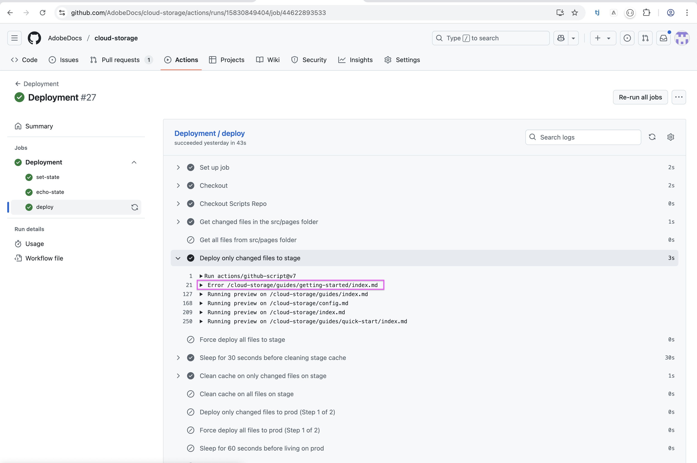
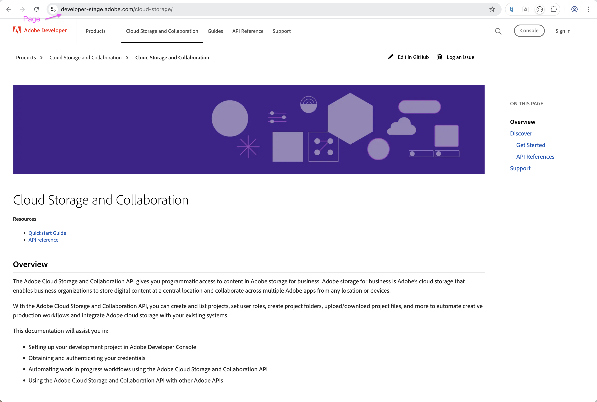
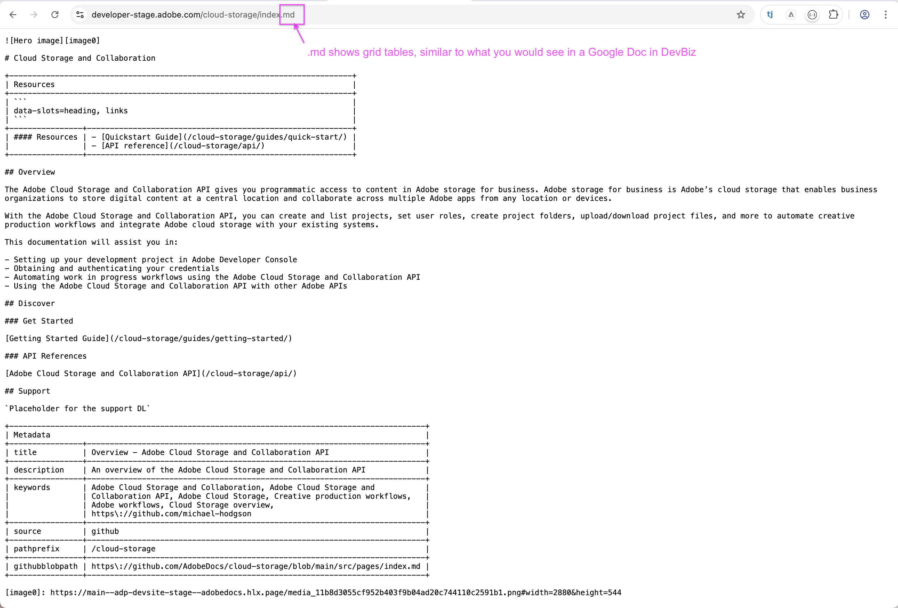
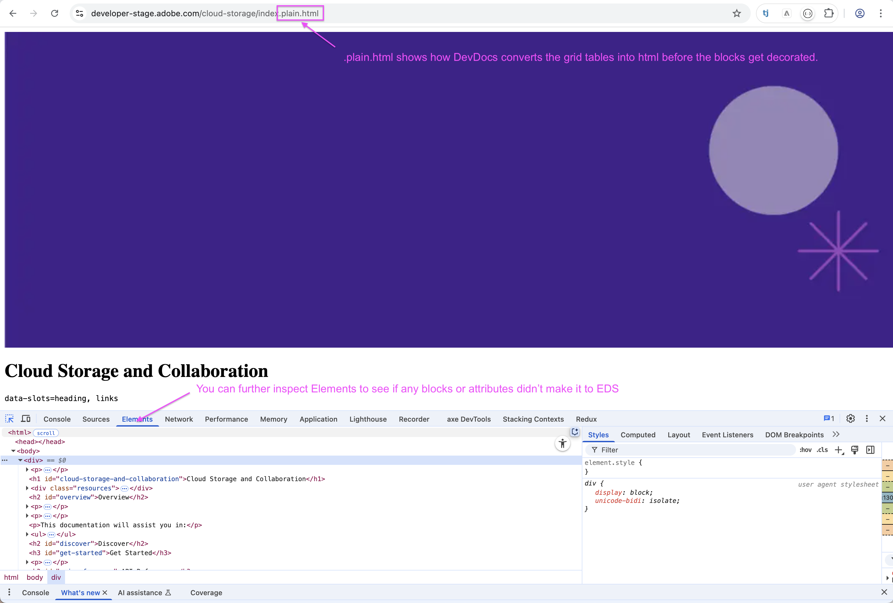

# Things to know as you migrate to DevDocs

Congratulations! The Next Generation Developer Website is going to improve the performance of your microsite, analytics, accessibility and mobile responsiveness. 

### DevDocs - Steps to take to migrate your Repo to EDS

| Action | Notes |
|--------|-------|
| Ensure that all updates have been committed and the repo is ready to be converted to EDS.  |  |
| You must be a contributor and have access to the repo you would like to convert.  | Both Gatsby and EDS will utilize the same Github Repo under Adobe Docs and EDS will start with a branch on top of your existing pages.  |
|DevSite team will create a branch in your repo - EDS-Migration npm run install| We will update your package.json file that add utility scripts in the branch |
| Generate config file: npm run buildNavigation | This generates config.md from gatsby-config.js |
| Build redirections: npm run buildRedirections | Redirects Gatsby bookmarks to EDS |
| Make file system case-sensitive: $ git config core.ignorecase false | Only kebab-case files can be deployed to EDS. If core.ignorecase true, renaming a file from uppercase to lowercase won't be detected as a change by Github. |
| Add file extensions to relative links: npm run normalizeLinks | Required by DevDocs for top nav, side nav, breadcrumbs, next-prev nav, and links in general |
| Renames files and associated links to kebab-case: npm run renameFiles| Required by EDS to deploy successfully |
| Fix dead links: npm run lint | This will prevent page 404s |
| If you run into errors, look at Best practices for migration | |
| Let us know on the slack channel #adobe-developer-website if you have any issues or any questions! | |

### Test on stage:
Go to Actions > Deployment > Run Workflow > Select branch and stage environment. Also check Force deploy all files

Debugging tips:

* Check deploy logs to see if a page failed

* Append '.md' or '.plain.html' to the page to inspect what made it to EDS

